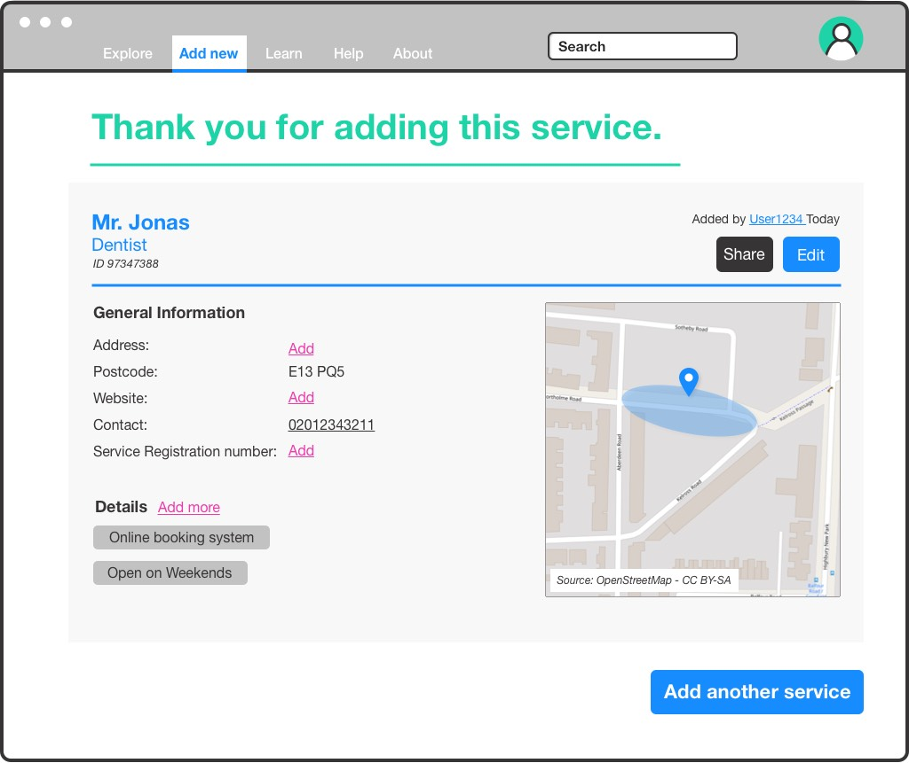
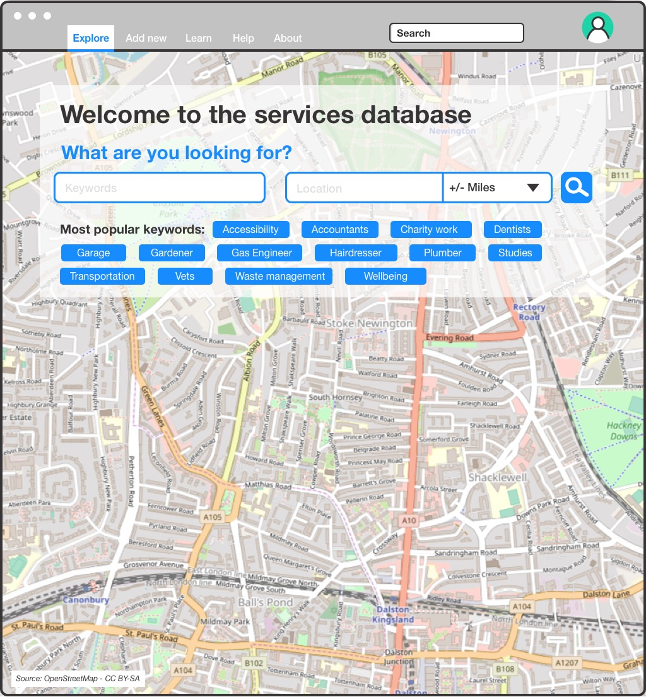
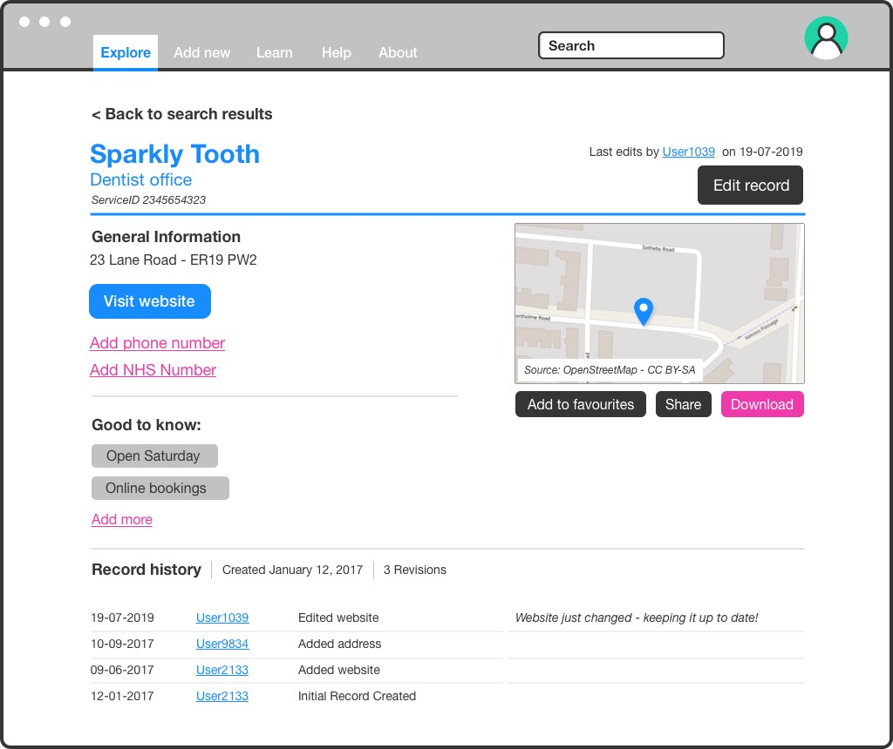
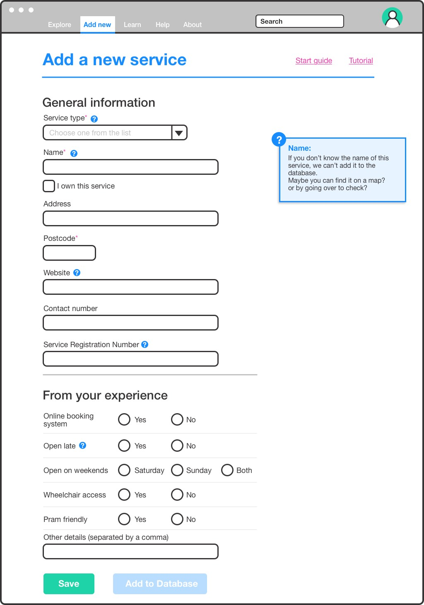
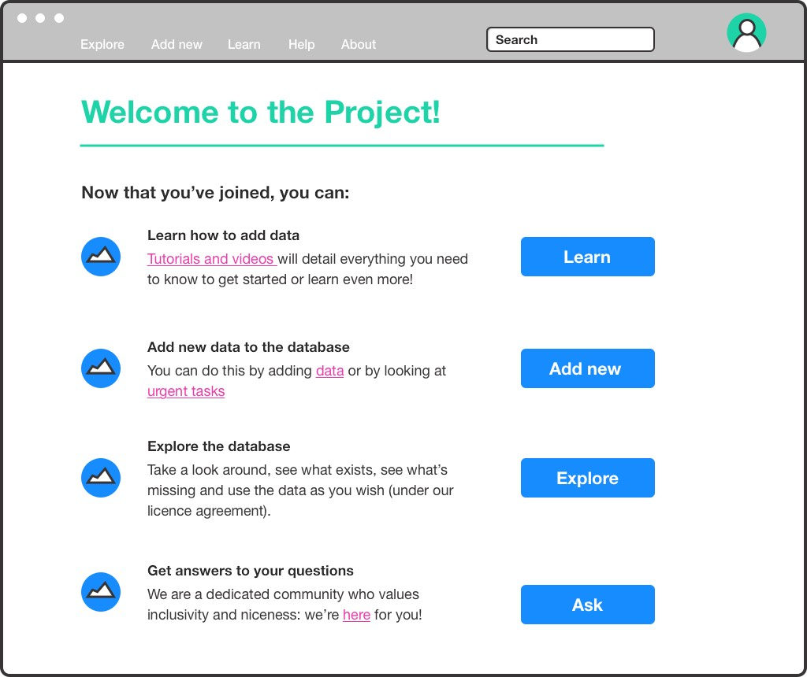
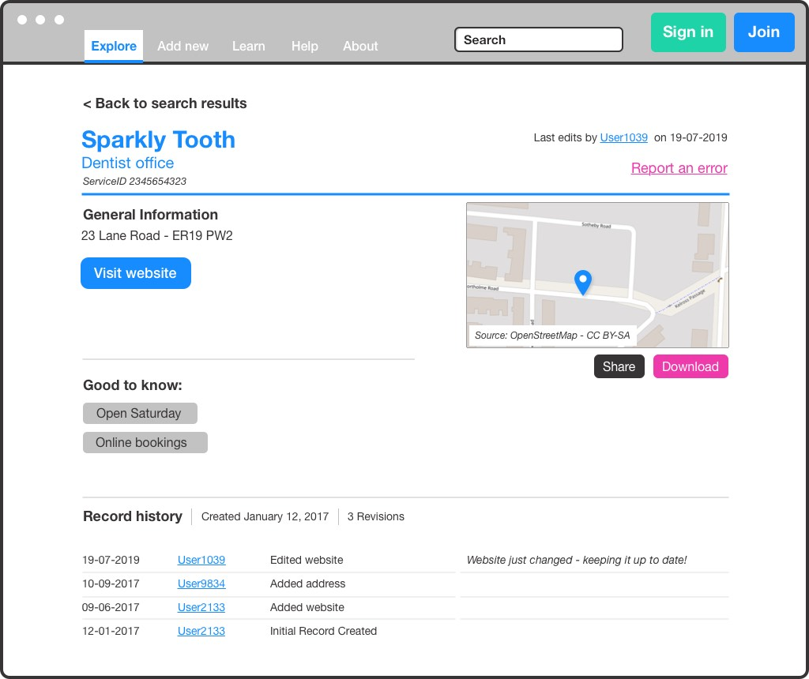
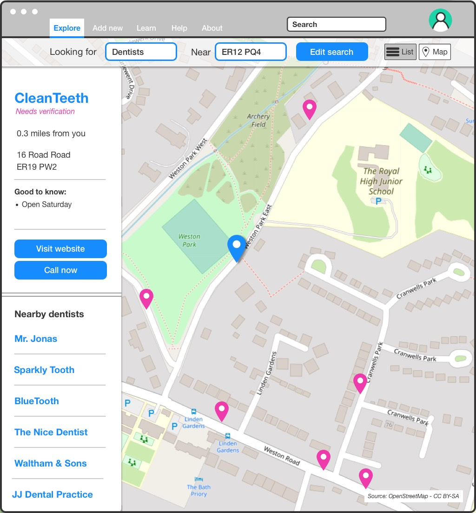
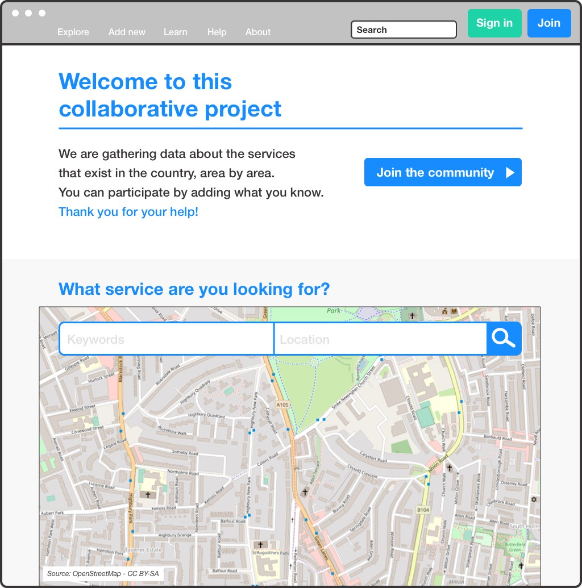
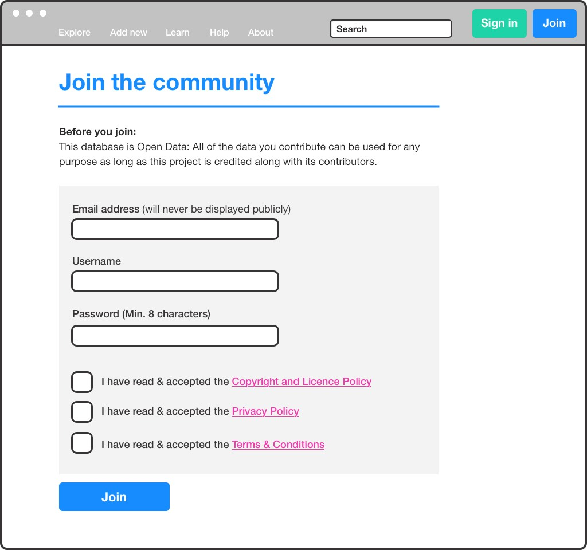
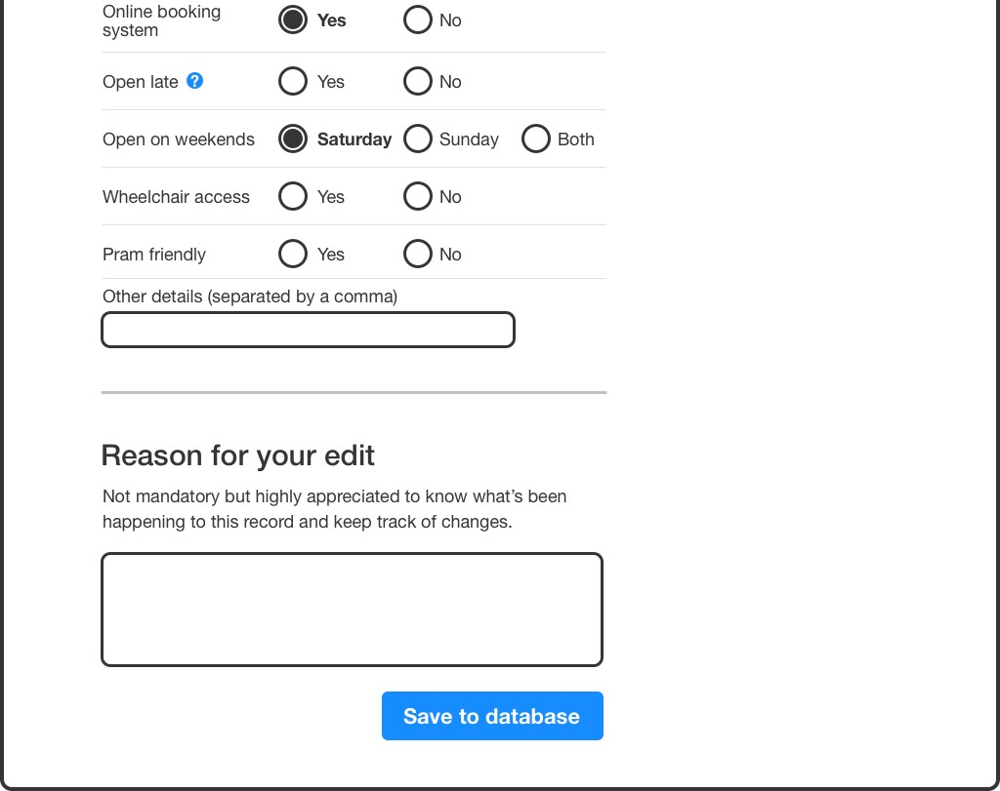

The example aims to illustrate how some of the ‘patterns’ (a repeatable solution to a commonly occurring problem) described in this guide can be applied in the context of a real application. The example should help you to understand and apply the patterns in your own projects.

## Maintaining data for a community directory

People and businesses in a city or region can often struggle to find information about the range of services available to them. These services might relate to a range of topics, eg health and wellbeing, waste management or transportation. The information about those services is often spread across a mix of local government, local business and community websites.

In our example, a project has been set up to create a directory of services that will help people more easily find and advertise the services offered in a local area.

The range of services to be added to the directory means no single organisation currently holds a full list. Collecting the data will require getting information from a variety of people and organisations.

The project has chosen to use collaborative maintenance to share the work of contributing to the directory across the local community. This will allow public, private and third-sector organisations to list their services.

The contributors will see benefits in making their services more discoverable. The community will benefit from having access to a more comprehensive source of data and information.

This type of project is an example of a **[Shared Directory](/patterns/project-types/shared-directory)**.

Each of the sections below illustrates one or more pages in the project website. The pages demonstrate how a range of patterns are useful in designing the services. The individual patterns are named and linked in the text.

## Project homepage

Users will land on the homepage for various reasons. They may be looking for a service or for more information about the project. If they are aware of the project they may wish to add a new record to the directory.

The project homepage explains: what the project is about; what service it provides; and how people can participate. It also provides direct access to the data in the form of a search interface and explorable map (**[Explorable Data](/patterns/encouraging-contributions/explorable-data)**).

The aims of the project are introduced, as part of the overall **[Onboarding Process](/patterns/community-management/onboarding-process)**.

## Joining the community

The project needs to recruit a range of contributors from across the local community and local businesses.

Rather than allowing **[Anonymous Contributions](/patterns/editing/anonymous-contributions)**, the project has decided to require people to register to submit entries. By using **[Attributable Contributions](/patterns/editing/attributable-contributions)** the project hopes to better engage with the community and support implementation of **[Moderation](/patterns/maintaining-quality/moderation)** features. To enable this, only the minimum amount of information is collected about each user.

To build trust, it’s important that when people sign up to a project they understand how their personal data is being used, so the project has **[Published Policies](/patterns/project-governance/published-policies)**. It asks for consent for use of data during sign-up.

The project has **[Clear Licensing](/patterns/project-governance/clear-licensing)** of its data. To support that it asks for users to agree to a **[Contributor Licence](/patterns/project-governance/contributor-licence)** so that rights for reuse of the data in the directory are clear to everyone.

## The onboarding process

To help recruit and train new users, who may have a mix of skills and abilities, the project has created an **[Onboarding Process](/patterns/community-management/onboarding-process)**. After signing up, users are presented with a welcome page that provides them with links to training material, community support and direct prompts for how to contribute.

To avoid confusing new users with too much information, the project uses a **[Learning Curve](/patterns/community-management/learning-curve)** to present users with the information they need as a new user.

The project’s user research has confirmed that many users will likely join the project to just add a few records. So to help **[Respect Users’ Time](/patterns/community-management/respect-users-time)** and increase coverage of the directory, the early user experience focuses on adding new data rather than reviewing existing records.

## Encouraging participation

To encourage regular participation, the project leads have decided to **[Gamify Contributions](/patterns/encouraging-contributions/gamify-contributions)**. Their research has indicated that several community groups are keen to regularly contribute to the project. The team felt that providing incentives and recognition for the volunteer work will help to encourage regular contribution.

The gamification has been implemented in a variety of ways. For example after signing in users will see a summary of their individual contributions. It also shows a leaderboard of active contributors.

The project also had a **[Progress Indicator](/patterns/encouraging-contributions/progress-indicator)** showing how much progress the contributors have made each month. This helps to build a shared sense of progress across the community.

## Contributing new data

To help catalogue local services, the project has decided to initially focus on collecting some basic information. This includes the name, location and some accessibility information that is extremely important to service users.

This **[Fixed Schema](/patterns/data-model/fixed-schema)** is presented as a simple online form that will allow users to add a new record or edit an existing record.

By **[Explaining Fields](/patterns/data-model/explain-fields)** the form shows users what information they need in order to contribute. By minimising required fields the project hopes to help users contribute data that can later be improved by others.

The form uses **[Field Validation](/patterns/maintaining-quality/field-validation)** to ensure that website URLs, telephone and service registration numbers are correct. This helps to address potential data-quality issues.

Recognising that not all users can contribute all information, the project is happy to **[Accept Incomplete Records](/patterns/data-model/accept-incomplete-records)**.

It’s possible that the community’s needs for the directory will change in the future but the project has decided to focus on building its core dataset and community first.

## Confirming contributions

The project has built in **[Feedback Loops](/patterns/community-management/feedback-loops)** that help to acknowledge useful contributions and help contributors feel that their work is recognised and useful.

After submitting a record the system immediately displays the newly added location on a map. **[Explorable Data](/patterns/encouraging-contributions/explorable-data)** helps the contributor confirm that the data is correct and may prompt further entries. For example, it asks if the map marker in the right location, and if there are other nearby services that the user might add?

Immediately adding data to a map interface and making it searchable **[Delivers Individual Value](/patterns/encouraging-contributions/deliver-individual-value)** to contributors. For example, a local community group or business can immediately see that they are part of the public directory.

The newly added record is **[Visibly Editable](/patterns/encouraging-contributions/visibly-editable)** to encourage users to add more information and see how they can correct errors. **[Suggested Edits](/patterns/encouraging-contributions/suggested-edits)**, eg to add a website, are also used to directly prompt users to improve the data.

## Improving quality

The project has chosen to focus on populating the new directory, so places a value on making data visible as soon as possible. This helps to demonstrate the value of the directory.

The project leads recognise the need to address potential quality issues and define an approach to **[Moderation](/patterns/maintaining-quality/moderation)**. They decided not to require **[Mandatory Review](/patterns/maintaining-quality/mandatory-review)** of submissions because they have limited capacity and ability to review all submissions. Delays in adding or fixing data might also reduce trust in the service.

Instead the project is using **[Retrospective Reviews](/patterns/maintaining-quality/retrospective-review)** to make it easy for users and contributors to identify and fix problems as they occur. As the community may have more information and insight into where errors exist, this was felt to be the right option.

To implement this approach, the project uses a variety of ways to help flag potential quality issues.

For example, on the listings included on the search results page, new records are marked as “needs verification” (**[Flag For Review](/patterns/maintaining-quality/flag-for-review)**) to encourage contributors to verify each other’s work.

Following review or updates new records will be **[Marked as Verified](/patterns/maintaining-quality/marking-as-verified)** to indicate that they’ve been checked.

Another approach to help with reviewing data is prompting users for a reason for making individual changes to the system.

By attaching notes as well as a timestamp to each change (or **[Changeset](/patterns/data-model/changeset)**) submitted by contributors, it becomes easier for the project to build other features.

When looking at the listing for an individual service, users are presented with a list of recent changes to the individual record. **[Track Changes](/patterns/workflow/track-changes)** can help users understand how and why individual records have been changed and perhaps remove them (**[Revert Change](/patterns/editing/revert-change)**).
 
 

The project also uses **[Error Reporting](/patterns/maintaining-quality/error-reporting)** a way to encourage a wider group of people using a service to flag errors. This feature is available to everyone, even if they are not signed up as a contributor.

The record will be marked as needing attention (**[Flag For Review](/patterns/maintaining-quality/flag-for-review))** and will be inspected by an existing contributor or a member of the project team. In the error-reporting process, the project also encourages people to sign-up and fix the error themselves as part of an **[Onboarding Process](/patterns/community-management/onboarding-process)**.

## Summary

This example is not intended to be a comprehensive design for a project using collaborative maintenance – there are other considerations to take into account. For example how to engage with and support a community, how to provide access to data, etc.

But, by illustrating some of the common features of a collaborative maintenance project and how these are described by the design patterns in our catalogue, we hope to have clarified how you can apply them in your work.

We encourage you to [review the complete catalogue](/patterns) to explore more of the patterns.
